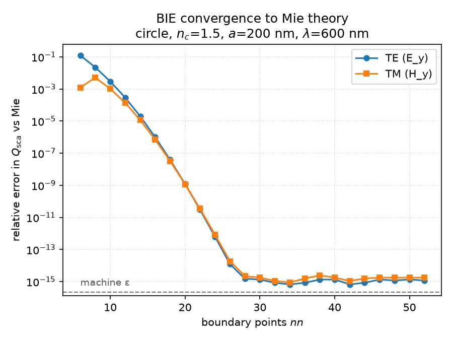
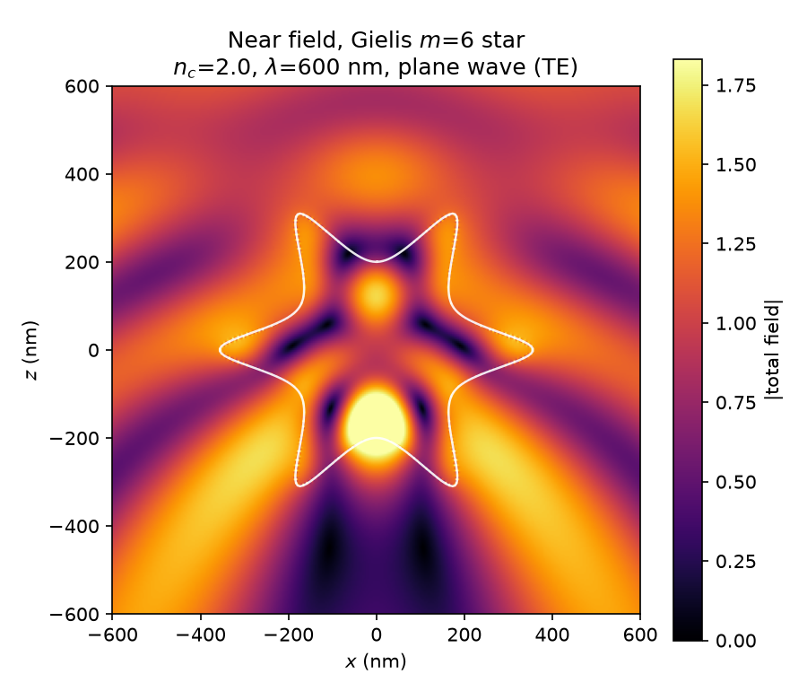

# pysie2d

A 2-D boundary-integral (Müller-type BIE) solver for time-harmonic
electromagnetic scattering from a single smooth cylinder — circular or
Gielis-superformula cross-section — in a homogeneous background. Validated
against analytic Mie theory, with a typed public API and CI.

## Scope and non-goals

This package is distilled from a larger private research code; it deliberately
covers only the **homogeneous-background, single-particle core** — the part
that can be validated end-to-end against a closed-form reference. The following
capabilities of the parent code are intentionally **out of scope** here:

- layered / substrate media (half-space and slab Green functions),
- waveguide coupling,
- periodic arrays and SSH-type chains,
- multi-particle systems (dimers, arrays),
- inverse design / optimisation,
- result databases and Dask batch pipelines,
- quasi-normal-mode extraction _(planned; see roadmap)_.

## Figures

Relative error of the scattering efficiency `Q_sca` versus the number of
boundary points, converging toward analytic Mie theory (both polarisations):



Near field of a Gielis `m = 6` star under plane-wave illumination (scattered
field outside the boundary, internal field inside):



Regenerate them with:

```bash
uv run python examples/convergence_study.py
uv run python examples/nearfield_map.py
```

## Formulation (summary)

- The cylinder is invariant along its axis, so Maxwell reduces to a scalar
  Helmholtz problem for one field component (`E_y` for TE, `H_y` for TM).
- The field is represented by single- and double-layer potentials on the
  boundary; matching across the interface gives a Müller-type second-kind
  boundary integral equation.
- Discretising the boundary with `nn` quadrature points yields a dense
  `2nn × 2nn` complex system `M(λ)·ei = rhs`, solved directly.
- The logarithmic Green-function singularity is handled analytically in the
  diagonal terms; complex wavenumbers are supported throughout.
- Lengths are in nm, the time convention is `exp(-iωt)`, and outgoing waves are
  `H_n^{(1)}`.

Full details and every sign/layout convention are in
[docs/conventions.md](docs/conventions.md). The analytic reference is Bohren &
Huffman, *Absorption and Scattering of Light by Small Particles*, ch. 8; the
integral formulation follows C. Müller, *Foundations of the Mathematical Theory
of Electromagnetic Waves* (Springer, 1969).

## Validation

The physics test suite compares the solver against analytic Mie theory for a
circular cylinder: scattering / extinction / absorption efficiencies, the
optical theorem on a lossy particle, energy conservation on a lossless one, the
convergence rate, and the 2-D `1/√(kr)` far-field decay. At `nn = 300` the
efficiencies agree with Mie to a few parts in `10³`; the error decreases with
`nn` until it reaches the fixed angular-quadrature floor of the far-field
integrator. See `tests/` for the exact tolerances and the reasoning behind them.

## Install / run / test

Requires Python 3.12 and [uv](https://docs.astral.sh/uv/).

```bash
uv sync                       # create the environment
uv run pytest                 # run the validation suite
uv run ruff format --check .  # formatting
uv run ruff check .           # lint
```

Minimal use:

```python
from pysie2d import BIESolver, Geometry, Material

geom = Geometry.gielis(rad=200, n_pts=300, m=0)   # circular cylinder, nm
mat = Material(n_core=1.5, n_clad=1.0, pol=2)      # TE
result = BIESolver(geom, mat).scatter(wavelength=600.0)

print(result.efficiencies())                       # {'qsca', 'qext', 'qabs'}
```

## Performance

The system is a dense `2nn × 2nn` complex matrix; at `nn = 300` (a `600 × 600`
solve) a single wavelength takes milliseconds, so wavelength sweeps are cheap
serial `for` loops — no parallelism required.

## Roadmap

- **v0.1.0** — core scattering: plane-wave excitation, near/far fields,
  cross-section efficiencies, Mie validation, convergence study, CI. _(this
  release)_
- **v0.2.0** — line-dipole (point-source) excitation and the self-Green
  function → relative LDOS / Purcell maps.
- **v0.3.0** — quasi-normal-mode extraction via Beyn's contour method,
  validated against analytic Mie resonances.

## License

MIT — see [LICENSE](LICENSE).
